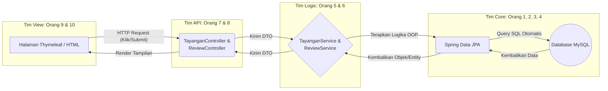
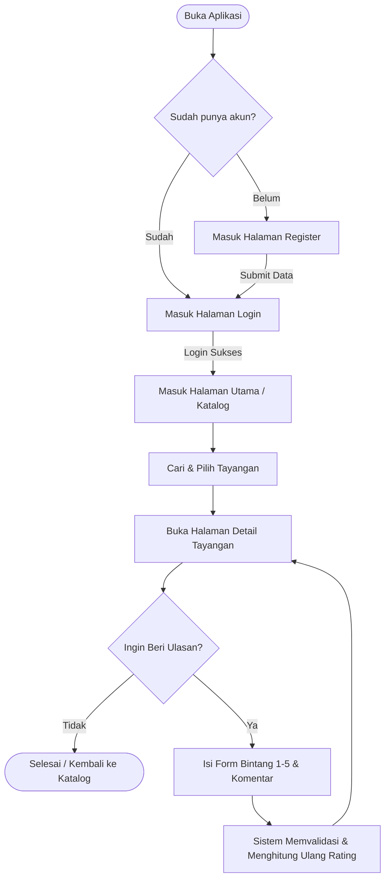
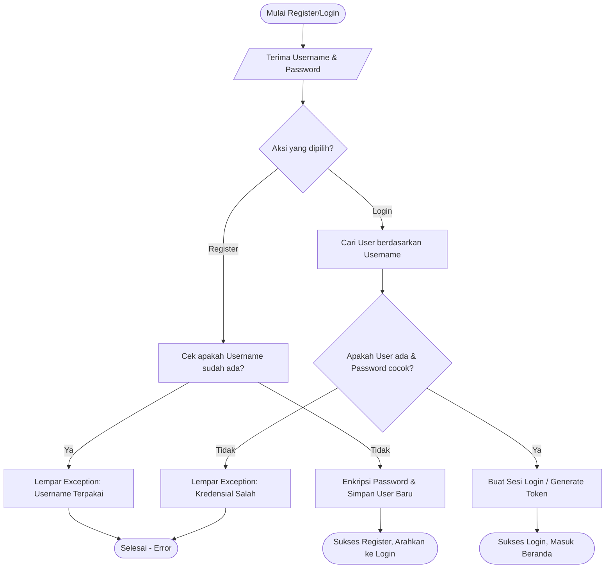
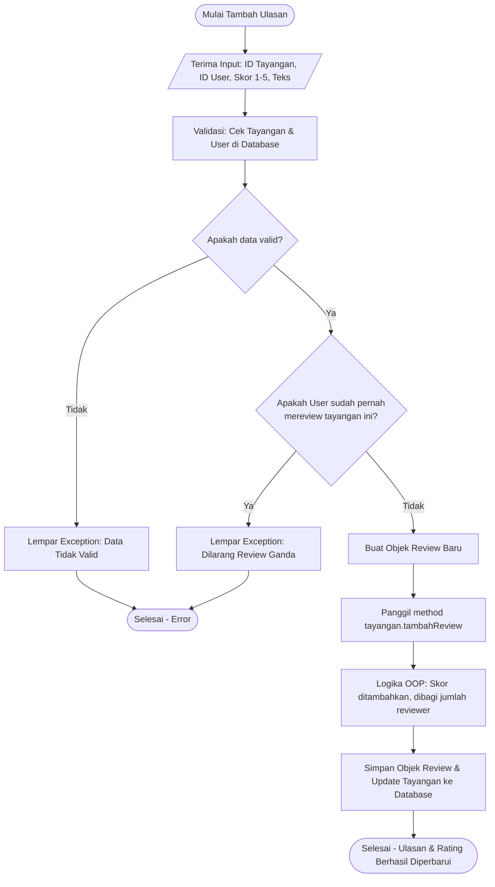

# Dokumentasi Alur Keseluruhan Proyek Absolute Cinema
**Proyek:** Absolute Cinema (Sistem Review & Rating Film Berbasis OOP)
**Teknologi:** Java, Spring Boot, Thymeleaf, MySQL

Dokumen ini memuat arsitektur sistem dan alur kerja (flowchart) utama yang menghubungkan seluruh komponen aplikasi yang dikerjakan oleh 12 anggota tim.

---

## 1. Arsitektur Sistem (Bagaimana Semua Tim Bekerja Sama)
Diagram ini menunjukkan alur data dari layar pengguna (*Frontend*) hingga tersimpan ke *Database* (*Backend*).

---

## 2. Alur Pengguna Utama (User Journey)
Ini adalah alur dari sudut pandang *User* saat membuka aplikasi Absolute Cinema dari awal sampai selesai memberi ulasan.

---

## 3. Flowchart Autentikasi (Register & Login)
**Penanggung Jawab:** Orang 8 & 10
Alur logika ketika pengguna mendaftarkan akun baru atau mencoba masuk.

---

## 4. Flowchart Tambah Ulasan & Hitung Rating Otomatis
**Penanggung Jawab:** Orang 6 & Orang 2
Ini adalah fitur utama proyek OOP ini. Menerapkan enkapsulasi untuk menghitung rata-rata skor saat ulasan baru ditambahkan.

